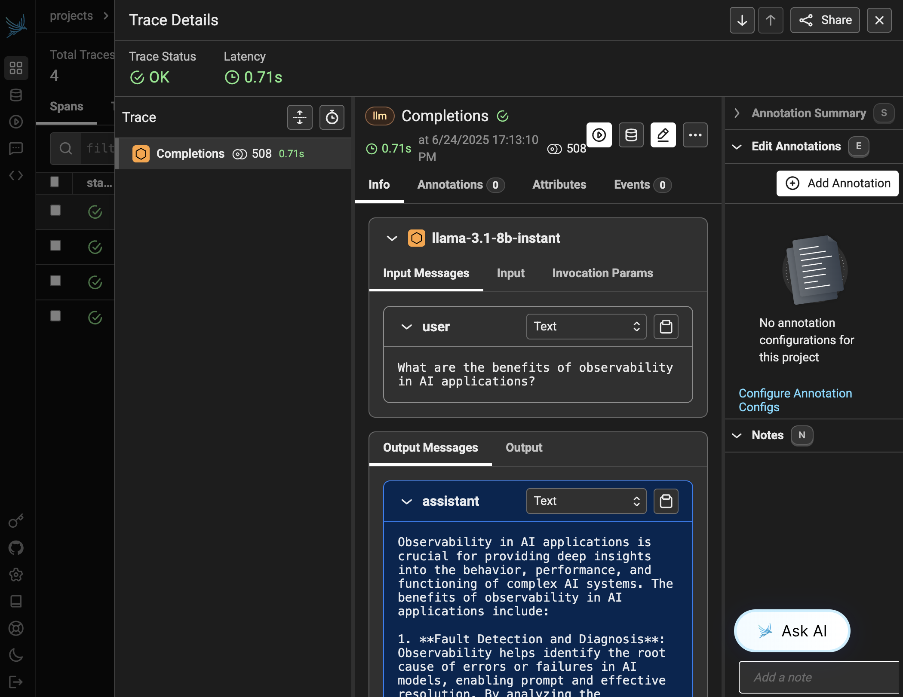
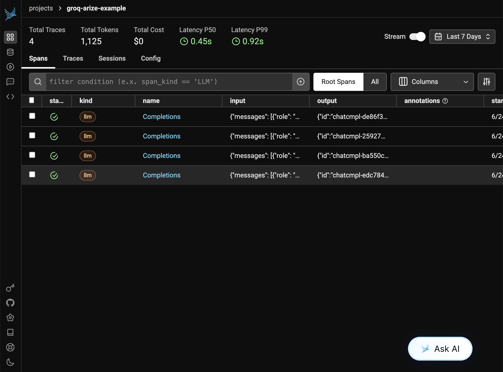

# Groq + Arize Phoenix Observability Example

This example demonstrates how to integrate Groq API calls with Arize Phoenix for comprehensive observability and monitoring of your AI applications.

## Features

- 🤖 Groq API integration for fast LLM inference
- 📊 Arize Phoenix observability and tracing
- 🔧 Environment variable management with python-dotenv
- 📈 Automatic instrumentation of Groq API calls
- 🎯 Example conversations with different prompts

## Prerequisites

1. **Groq API Key**: Get your API key from [Groq Console](https://console.groq.com/)
2. **Phoenix Setup**: Install and run Phoenix locally or use Phoenix Cloud

## Installation

1. Install dependencies:
```bash
uv sync
```

2. Set up environment variables:
```bash
cp .env.example .env
# Edit .env and add your GROQ_API_KEY
```

3. Start Phoenix (if running locally):
```bash
# Option 1: Using pip
pip install arize-phoenix
python -m phoenix.server.main serve

# Option 2: Using Docker
docker run -p 6006:6006 arizephoenix/phoenix:latest
```

## Usage

Run the example:
```bash
uv run python main.py
```

This will:
1. Set up Phoenix tracing
2. Create a Groq client
3. Run several example conversations
4. Send all traces to Phoenix for observability

## Observability Features




With this setup, you'll get:

- **Request/Response Logging**: All Groq API calls are automatically logged
- **Performance Metrics**: Latency, token usage, and throughput metrics
- **Error Tracking**: Automatic error capture and analysis
- **Prompt/Response Analysis**: Content analysis and evaluation
- **Cost Tracking**: Token usage and cost monitoring

## Phoenix Dashboard



After running the example, visit your Phoenix dashboard:
- Local: http://localhost:6006
- Phoenix Cloud: https://app.phoenix.arize.com

You'll see:
- Trace timeline and spans
- Token usage statistics
- Model performance metrics
- Request/response content
- Error rates and patterns

## Configuration

### Environment Variables

- `GROQ_API_KEY`: Your Groq API key (required)
- `PHOENIX_COLLECTOR_ENDPOINT`: Phoenix collector endpoint (optional, defaults to local)
- `PHOENIX_PROJECT_NAME`: Project name in Phoenix (optional)

### Supported Models

The example uses `llama-3.1-8b-instant` by default, but you can use any Groq-supported model:
- `llama-3.1-8b-instant`
- `llama-3.3-70b-versatile`
- `meta-llama/llama-4-scout-17b-16e-instruct`
- `meta-llama/llama-4-maverick-17b-128e-instruct`

## Advanced Usage

### Custom Tracing

```python
from opentelemetry import trace

tracer = trace.get_tracer(__name__)

with tracer.start_as_current_span("custom_operation") as span:
    # Your custom code here
    span.set_attribute("custom.attribute", "value")
```

### Batch Processing

```python
def process_batch(client, messages):
    responses = []
    for message in messages:
        response = chat_with_groq(client, message)
        responses.append(response)
    return responses
```

## Troubleshooting

1. **Missing API Key**: Ensure `GROQ_API_KEY` is set in your `.env` file
2. **Phoenix Connection**: Verify Phoenix is running and accessible
3. **Dependencies**: Run `uv sync` to ensure all packages are installed

## Next Steps

- Explore Phoenix's evaluation features
- Set up alerts and monitoring
- Integrate with your production applications
- Experiment with different models and prompts
